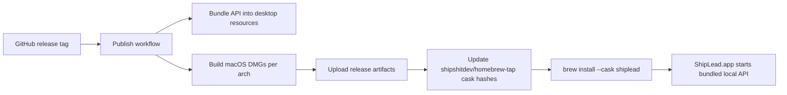
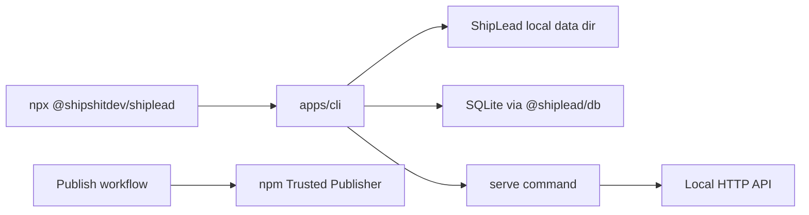
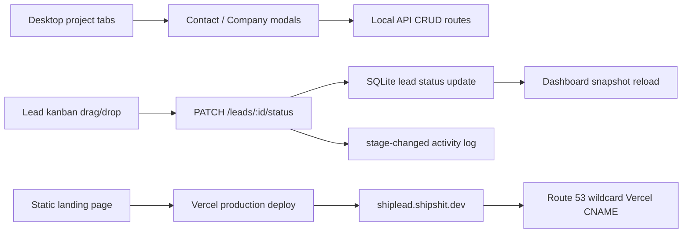

# 2026-04-23

## Session 1 — First End-to-End Implementation

### Affected Components

- Monorepo scaffolding
- Shared domain model
- SQLite persistence
- HTTP API
- Electron desktop app
- Next.js web app

### What Was Done

- Mirrored the `shipcode` workspace shape with Bun workspaces and Turbo
- Implemented typed domain contracts for workspace, projects, brands, offers, contacts, companies, leads, opportunities, tasks, activities, inbox, sequences, and enrollments
- Added SQLite schema, query/store layer, and demo seed data
- Added bounded AI helper packages for research, personalization, reply triage, sequence advancement, channel draft generation, and enrichment
- Implemented API routes for dashboard, search, CRUD, inbox, sequences, enrichment, and reply triage side effects
- Implemented a desktop-first operator cockpit wired to the API
- Implemented a web dashboard wired to the same API
- Added desktop-side API lifecycle management so the Electron app can boot and health-check the local API automatically
- Fixed the desktop renderer theme pipeline by aligning it with `../shipcode` and adding an explicit Tailwind v4 source for local renderer files
- Reworked the desktop UI into the ShipCode shell pattern: hidden-inset titlebar, dense sidebar navigation, compact stat cards, table/list panes, and tighter shared UI primitives
- Replaced local `@shiplead/ui` app usage with published `@shipshitdev/ui`, updated Bun lockfile to `@shipshitdev/ui@0.4.8`, and removed the duplicate local UI workspace package
- Verified typecheck, tests, web build, desktop code build, and live API health/dashboard responses

### Key Decisions

- Keep v1 self-hosted and local-first with a seeded demo workspace
- Use a dedicated API app instead of embedding the backend inside the desktop process
- Treat LinkedIn as copilot/manual-send territory in the domain model and UI language
- Keep agent behavior bounded and reviewable instead of building one opaque “AI SDR” blob

### Files Changed

- Root workspace config and package manifests
- `apps/api/**`
- `apps/web/**`
- `apps/desktop/**`
- `packages/shared/**`
- `packages/db/**`
- `packages/agents/**`
- `packages/channels/**`
- `packages/sequences/**`
- `packages/enrichment/**`
- `packages/ui/**`

### Verification

- `bun run typecheck`
- `bun run test`
- `bun run --cwd apps/web build`
- `bun run --cwd apps/desktop build:code`
- Verified generated desktop CSS now includes shell/layout utility classes such as `.app-region-drag`, `h-[var(--spacing-titlebar)]`, `grid-cols-[320px_1fr]`, `bg-tertiary`, `text-[11px]`, and `rounded-lg`
- Verified generated desktop CSS includes `@shipshitdev/ui` internal primitive classes such as `caption-bottom` and `divide-y`
- `bun run --cwd apps/api build`
- `node apps/api/dist/index.js`
- `curl http://127.0.0.1:4280/health`
- `curl http://127.0.0.1:4280/dashboard`

### Next Steps

- Replace demo channel behavior with real email and X providers
- Add CSV import and enrichment adapters
- Add create/edit flows in the UI beyond the current operator read surfaces

## Session 2 — Session Start

### Affected Components

- Session context
- Daily memory
- Inbox backlog

### What Was Done

- Loaded `SOUL.md`, `USER.md`, `MEMORY.md`, and raw memory for 2026-04-23 and 2026-04-22
- Loaded `.agents/SYSTEM/ai/SESSION-QUICK-START.md`, `.agents/SYSTEM/ai/USER-PREFERENCES.md`, today/yesterday session logs, and `.agents/TASKS/INBOX.md`
- Activated session-documenter tracking for the current main session

### Next Steps

- Continue from the inbox backlog or the next product task Vincent gives

## Session 3 — Homebrew Desktop Packaging

### System Flow Diagram

### Affected Components

- Electron desktop packaging
- Local API startup path
- GitHub CI/release workflows
- Web/README install copy
- Homebrew tap cask

### What Was Done

- Added an API desktop bundle command and wired desktop `build:code` to build/package that API bundle before Vite/Electron output
- Added `apps/desktop/electron-builder.yml` matching ShipCut's artifact naming, macOS/Linux targets, and unsigned app behavior
- Updated packaged desktop startup to prefer `process.resourcesPath/api/index.mjs`, preserving source-checkout fallback behavior for dev
- Added a main-process unit test for packaged API resolution
- Added GitHub CI and publish workflows for release-tag builds, web deploy, desktop artifact upload, and cask SHA updates
- Updated the public install command to `brew tap shipshitdev/tap` and `brew install --cask shiplead`
- Added `Casks/shiplead.rb` in the adjacent `homebrew-tap` repo and documented the cask there

### Key Decisions

- Use `ShipLead-#{version}-#{arch}.dmg` to match ShipCut's arch-specific cask URL pattern
- Keep cask SHA values as release placeholders; the publish workflow computes real arm/intel hashes after DMGs are uploaded
- Bundle the API as a single ESM file to avoid shipping a monorepo or workspace `node_modules` tree for backend startup

### Verification

- `bun run format:check`
- `bun run lint`
- `bun run typecheck`
- `bun run test`
- `bun run --cwd apps/web build`
- `bun run --cwd apps/desktop build:code`
- `PORT=4291 SHIPLEAD_DATA_DIR=$(mktemp -d) node apps/api/dist/desktop/index.mjs`
- `curl -fsS http://127.0.0.1:4291/health`
- `curl -fsS http://127.0.0.1:4291/dashboard`
- `CSC_IDENTITY_AUTO_DISCOVERY=false npx electron-builder --mac --arm64 --publish never`
- Verified `apps/desktop/out/mac-arm64/ShipLead.app/Contents/Resources/api/index.mjs` exists
- `ruby -c Casks/shiplead.rb` in `../homebrew-tap`

### Notes

- Local `brew style --cask Casks/shiplead.rb` could not run because this checkout is not registered as a local Homebrew tap; Ruby syntax validation passed instead
- The adjacent `homebrew-tap` repo already had an untracked `Casks/shipcut.rb` before this task

### Next Steps

- Create the GitHub release/tag and run the publish workflow when ready
- Commit/push the `homebrew-tap` updates so the cask is available from `shipshitdev/tap`

## Session 4 — ShipLead CLI

### System Flow Diagram

### Affected Components

- CLI package
- API server exports
- Release workflow
- Web and README install copy
- Bun lockfile

### What Was Done

- Confirmed `../shipcode` has a CLI in `apps/cli`, published as `@shipshitdev/shipcode` with the `shipcode` binary
- Added `apps/cli` for ShipLead, published as `@shipshitdev/shiplead` with a `shiplead` binary
- Added CLI commands for `serve`, `status`, `search`, `tasks`, `task-create`, `task-status`, `companies`, `company-create`, `contacts`, `contact-create`, and `lead-status`
- Refactored API startup into `apps/api/src/server.ts` so both the API entrypoint and CLI can share the same local HTTP server implementation
- Added `publish_cli` to `.github/workflows/publish.yml` with npm OIDC / Trusted Publisher publishing
- Updated README and web install component to show the CLI command

### Key Decisions

- Use the same default data directory as the desktop app: Application Support on macOS, AppData on Windows, XDG config on Linux
- Bundle internal workspace packages into the CLI dist with `tsup`, matching ShipCode/ShipCut's node:sqlite patching pattern
- Keep the CLI operational and local-first rather than adding a remote SaaS/API assumption

### Verification

- `bun install`
- `bun run --cwd apps/cli build`
- `bun run --cwd apps/cli typecheck`
- `bun run --cwd apps/cli lint`
- Compiled CLI smoke tests with temp data for `status`, `search`, `task-create`, `companies`, `company-create`, and `contact-create`
- `node apps/cli/dist/index.js serve --data-dir "$(mktemp -d)" --port 4292`
- `curl -fsS http://127.0.0.1:4292/health`
- `bun run format:check`
- `bun run lint`
- `bun run typecheck`
- `bun run test`
- `bun run build --filter=@shipshitdev/shiplead`
- `bun run --cwd apps/web build`
- `bun run --cwd apps/desktop build:code`
- `PORT=4293 SHIPLEAD_DATA_DIR="$(mktemp -d)" node apps/api/dist/desktop/index.mjs`
- `curl -fsS http://127.0.0.1:4293/health`

### Next Steps

- Commit and push ShipLead
- Create a release tag and run publish workflow with `publish_cli` enabled once npm Trusted Publisher is configured

## Session 4 — CRM Pipeline, Landing Page, Push, And Vercel Deploy

### System Flow Diagram

### Affected Components

- Desktop renderer CRM project views
- Shared schemas and types
- SQLite store
- API lead status route and tests
- Static Next.js landing page
- Vercel project configuration
- Route 53 DNS for `shipshit.dev`
- GitHub `master`

### What Was Done

- Tightened desktop project navigation into project-level tabs: Overview, Pipeline, Contacts, Companies
- Made Pipeline a full-height lead-status kanban board with equal-weight columns
- Added click-to-open right overlay lead detail panel
- Added Company and Contact creation modals in the desktop app
- Made contact creation optionally seed a manual lead when project, offer, and company context exists
- Added persisted lead drag-and-drop through `PATCH /leads/:id/status`
- Added optimistic desktop status updates and rollback on mutation failure
- Added `stage-changed` activity records when leads move
- Added API test coverage for lead status updates
- Replaced the API-backed web dashboard with a static ShipCut-style landing page for public deployment
- Added landing components: Header, Hero, InstallCommand, ProductMockup, Footer, logo mark, GitHub mark
- Added `apps/web/next.config.ts` with static export and root `vercel.json`
- Committed and pushed changes to `origin/master`
- Linked Vercel project `shipshitdev/shiplead.shipshit.dev`
- Deployed production landing page to Vercel
- Added Vercel custom domain `shiplead.shipshit.dev`
- Route 53 was at 50/50 record-set limit, so replaced the unused/broken `attention.shipshit.dev` explicit Vercel CNAME with `*.shipshit.dev CNAME cname.vercel-dns.com`
- Issued the Vercel certificate for `shiplead.shipshit.dev`

### Key Decisions

- Keep the public website static because Vercel should not depend on a local Shiplead API
- Use the ShipCut landing structure as the reference: sticky header, sharp two-line hero, GitHub CTA, install command, and product mock panel
- Use HTML5 drag/drop for the first lead kanban pass because it is enough for the current desktop target and avoids adding another dependency surface
- Persist lead moves in the API instead of treating the kanban as local UI state
- Consolidate DNS with a wildcard Vercel CNAME instead of deleting active product records; this avoids Route 53 quota pressure while allowing new Vercel subdomains

### Files Changed

- `.agents/memory/2026-04-23.md`
- `MEMORY.md`
- `.gitignore`
- `apps/api/src/app.ts`
- `apps/api/src/app.test.ts`
- `apps/desktop/src/renderer/App.tsx`
- `apps/web/app/**`
- `apps/web/next.config.ts`
- `packages/db/src/index.ts`
- `packages/shared/src/schemas.ts`
- `packages/shared/src/types.ts`
- `vercel.json`

### Mistakes And Fixes

- Initial API build was run in parallel before shared/db dist artifacts were rebuilt; reran after the repo test/typecheck pipeline rebuilt dependencies and the API build passed
- `next build` rewrote `apps/web/next-env.d.ts` quote style; reverted that generated-file churn before final commit
- Route 53 rejected the direct `A shiplead.shipshit.dev 76.76.21.21` change with `MAX_RRSETS_BY_ZONE`; fixed by replacing the unused/broken `attention.shipshit.dev` record with a wildcard Vercel CNAME
- HTTPS initially failed while DNS/cert state caught up; issued the Vercel certificate and verified HTTPS through resolved Vercel endpoints

### Verification

- `bun run lint:fix`
- `bun run lint`
- `bun run typecheck`
- `bun run test`
- `bun run --cwd apps/web build`
- `bun run --cwd apps/api build`
- `bun run --cwd apps/desktop build:code`
- Temp local API smoke for `/health`, `/dashboard`, lead status move, company create, contact create, activity create, and manual lead create
- `git push origin master`
- `vercel deploy --prod --scope shipshitdev --yes`
- `vercel domains add shiplead.shipshit.dev --scope shipshitdev`
- `aws route53 change-resource-record-sets` and `aws route53 wait resource-record-sets-changed`
- `vercel certs issue shiplead.shipshit.dev --scope shipshitdev`
- Verified public DNS resolves via `cname.vercel-dns.com`
- Verified Vercel serves the landing HTML containing `Leads in.` and `Pipeline out.`

### Commits

- `1aaa595 feat: add CRM pipeline workflows and landing page`
- `fab0dea chore: ignore Vercel project metadata`

### Deployment

- GitHub: `https://github.com/shipshitdev/shiplead`
- Production URL: `https://shiplead.shipshit.dev`
- Generated Vercel URL: `https://shipleadshipshitdev.vercel.app`
- Vercel project: `shipshitdev/shiplead.shipshit.dev`

## Landing Page + npm Publish

### What Changed

- Updated the landing hero copy so the first viewport clearly sells ShipLead as a local-first desktop app + CLI
- Replaced the old homepage install block with Homebrew desktop and `npx` CLI commands, plus short mode descriptions
- Moved internal CLI workspace packages into `devDependencies` so the published npm manifest is installable outside the monorepo
- Normalized the CLI bin path to `dist/index.js` after npm’s publish-time package normalization

### Verification

- `bun run --cwd apps/web build`
- `bun run format:check`
- `bun run build --filter=@shipshitdev/shiplead`
- `npm pack --dry-run` and local tarball `npx` smoke test
- Public npm verification from a clean temp directory:
  - `npm view @shipshitdev/shiplead version bin dependencies --json`
  - `npx -y @shipshitdev/shiplead status --json`

### Release State

- Published `@shipshitdev/shiplead@0.0.1` to npm
- Pushed source to `origin/master`
- Commits:
  - `caf70b8 feat: ship desktop install and publishable cli`
  - `a0b6623 chore: normalize cli bin path`

### Next Steps

- Add richer create/edit flows for leads, opportunities, tasks, and sequences
- Add CSV/import lead-gen workflow
- Add real email/X provider integrations and LinkedIn copilot task flows
- Request/increase Route 53 record-set quota or continue consolidating Vercel subdomains intentionally
